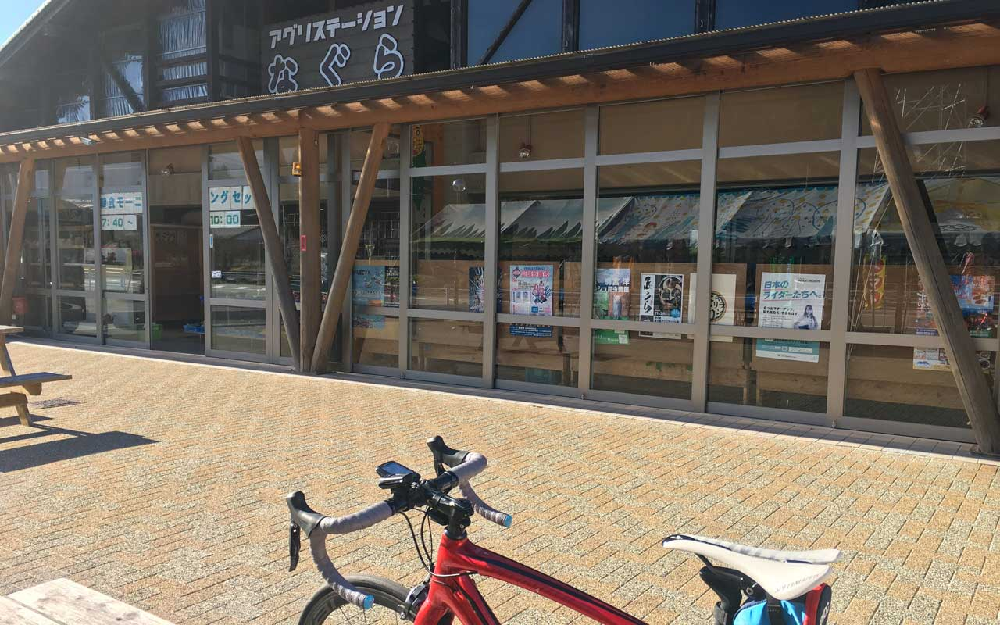
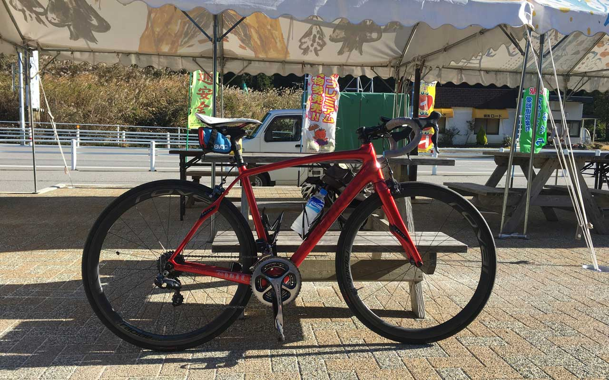
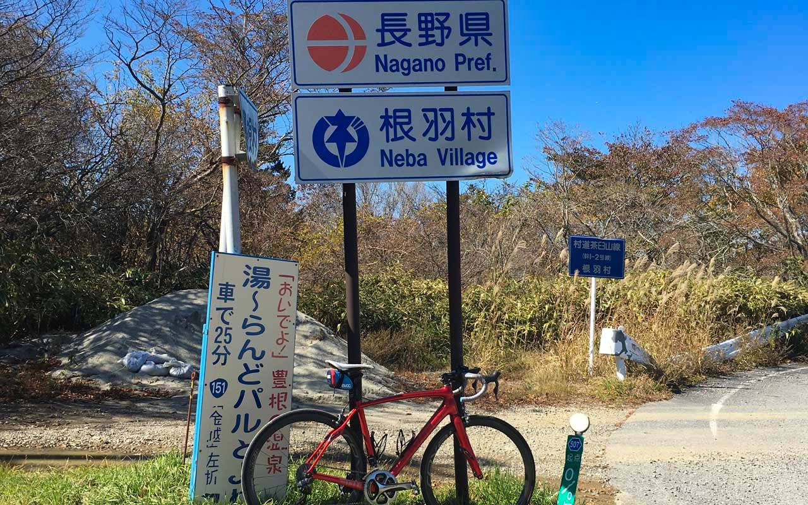

いつかは行ってみたいと思っていたまま行ってなかった茶臼山まで自転車で行ってきました。<!--more-->

前の日はあまり眠れずにそのまま朝の3時ころに準備をはじめて出かけました。なぜかこの日は意思がかたく、なかば勢いで自転車に乗ったような気がします。  まずはアグリステーションなぐらを目指して国道257号線を登ります。この日の朝方は風が強くて冷たかった…。朝日が差した時の身体中にエネルギーがみなぎる感じは凄く率直に太陽ってすごいなぁと思いました。



ここからが茶臼山高原道路の入り口となります。8%の登りの繰り返しと距離の長さに何度も立ち止まり「はたして本当にたどり着くことができるのだろうか」と不安になりながらも「明けない夜はない。終わりのない坂道はない」と格言めいたことを心のなかで念じながら登って行きました。  
単独行のおかげもあって足を引っ張る焦りはなかったので、時間はかかりましたが何とか茶臼山高原に到着。道路の起点には「長野県」の看板が！多分東三河から最短で行ける長野県境だとは思いますが、感無量でした。  
 

 

 
道中、紅葉もまぁまぁ綺麗で（あまり愛でる余裕がない）、山頂では観光客がおおく賑わっておりましたが帰りの時間を考えて滞在時間もそこそこにして山を降り始めました。  
 
茶臼山高原までの道のりで、すっかり足を使い切ってしまったものの達成感で満足していましたが、帰りの国道151号線は下り基調ですが登り返しがチョイチョイあって、もうわずかな坂も登れないヘロヘロな状態に。  

それでもだんだん見覚えのある風景が見え始めて「あぁ、ここからなら何とか帰れるかも」と思い直してゆっくり帰ってきました。
バックパックに詰め込んでおいたウィンドブレーカーが大活躍で、おかげで秋の冷たい風から身を守ってくれました。  
 
STRAVAのログでは160km、獲得標高2417m（たぶんそんなに登ってない）と自転車を始めて10年目にして初の記録づくしでした。何かに挑戦するのに遅過ぎることはないですが、今よりも若い時間は永遠に来ないということを最近自覚するようになり、何だか前向きになれたと思います。それが一番の進歩かもしれません。  
 
今回は無茶な部分もありましたので、今後は少しずつ身の丈にあったコース設定もしないといけないなぁと感じたソロライドでした。
