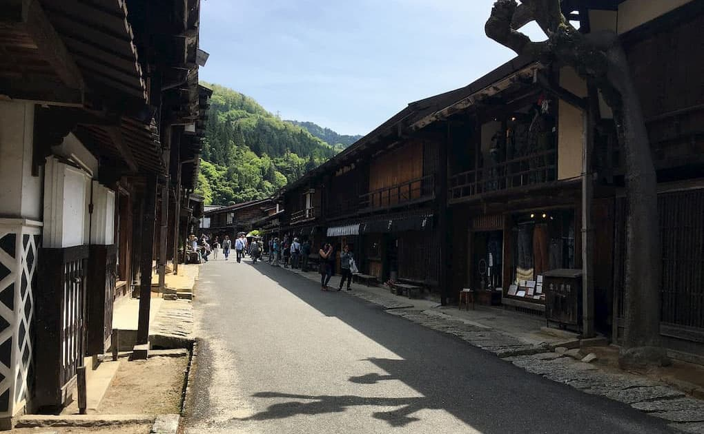

ゴールデンウィークは寝てばかりになるかなぁと思っていたのですが、思いの外体調が良かったので外出をよくしました。かなり昔に行ったので記憶にはないのですが、久しぶりに妻籠宿へ行ってきました。馬籠宿は何回か行っているのですが、妻籠宿も良いですね！風情があって、ちょうど春を迎えているのでタラの芽の天ぷらを添えたざる蕎麦をお昼に頂いて、帰りは昼神温泉へと抜ける道沿いに咲く花桃も見ることができて、春を堪能できました。

馬籠宿でも見かけましたが、妻籠宿でも外国人観光客で個人旅行をされている方を多くお見受けしました。インバウンド旅行者数が過去最多になっていますが、もっと個人旅行客が増えて日本の田舎の良さを知ってもらえるといいなと思いました。

 

  

 

  
