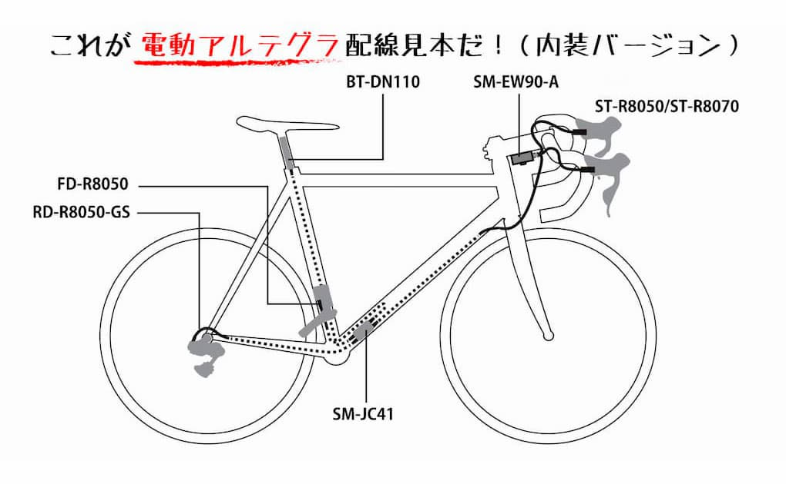

このエントリーは2017年6月9日に公開されましたが、2019年の内容に加筆・修正しました。
アルテグラR8000系を含めたシマノの料金が値上げになって、ようやくブログに掲載した料金も修正しました。<!--more-->
 

  
&nbsp;  

### 2019年5月のカタログ料金に修正しました。
値上げは知っていたのですが「更新しなきゃ・・・」と思っているあいだに消費税増税目前まできましたので焦って入力しなおしました。値上げ分にくわえて2019年10月の消費税10％へアップを考えるとだいたいの金額のイメージも変わってきます。参考になればと思って作った表も値上げしたあとでは全然アテにもならなかったですね。すみません・・・。  
 

### 選択肢が多くて結局全部でいくらくらいかわからない・・・
色々なサイトを見て回って機械式の普通のアルテグラはだいたい10万円くらいかなという感じはしました。　大体でいいから全部で幾らぐらいするのかパッと判断できる相場勘みたいなものって何事にも必要だと思うのですが、毎回シマノだけじゃなく自転車のコンポーネントの合計額というのが分からなくなってきています。というのも電動になってケーブルの外装・内装やキャリパーブレーキからダイレクトマウントブレーキ、そしてディスクブレーキと選択肢が広がるにつれて全体の金額というのが把握しにくくなってきているからだと思います。  
ということで、色んなサイトに掲載されている料金表とデュラエースの内装キットの値段を参考にして大体の組み合わせごとのお値段を自分で勝手に表にしてみました。ワイヤー、BB、ペダルなど、その他もろもろの値段は入ってません。自分で勝手に表にしただけだから間違ってても知りません。
ちなみに105はだいたい税込で6万円くらいを僕は目安に考えています。  
 
**注意！　　料金が間違っていても責任は一切取りませんのであしからず。**

&nbsp;
 
### 8000系アルテグラ　機械式  
<table><caption>アルテグラ機械式キャリパーブレーキ仕様</caption>
<tr><td>ST-R8000</td><td>機械式STIレバー</td><td align="right">34,638円</td></tr>
<tr><td>FD-R8000</td><td>機械式フロントディレイラー</td><td align="right">5,621円</td></tr>
<tr><td>RD-R8000-GS</td><td>機械式リアディレイラー（ロングケージ</td><td align="right">9,666円</td></tr>
<tr><td>BR-R8000</td><td>キャリパーブレーキ（前後ペア</td><td align="right">14,629円</td></tr>
<tr><td>FC-R8000</td><td>クランクセット</td><td align="right">27,333円</td></tr>
<tr><td>CS-R8000</td><td>カセットスプロケット（11-25Ｔ、11-28Ｔ、12-25T）</td><td align="right">8,123円</td></tr>
<tr><td>CN-HG701-11</td><td>チェーン</td><td align="right">4,758円</td></tr>
<tr><th style="text-align:left" colspan="2">合計</th><th style="text-align:right">104,768円(税抜)</th></tr>
</table>
   

 
<table><caption>アルテグラ機械式油圧ディスクブレーキ仕様</caption> 
<tr><td>ST-R8020</td> <td>機械式STIレバー（ディスクブレーキ</td><td align="right">55,321円</td></tr>
<tr><td>FD-R8000</td><td>機械式フロントディレイラー</td><td align="right">5,621円</td></tr>
<tr><td>RD-R8000-GS</td><td>機械式リアディレイラー（ロングケージ）</td><td align="right">9,666円</td></tr>
<tr><td>BR-R8070</td><td>ディスクブレーキ・キャリパー（前）</td><td align="right">6,876円</td></tr>
<tr><td>BR-R8070</td><td>ディスクブレーキ・キャリパー（後）</td><td align="right">6,639円</td></tr>
<tr><td>SM-RT800</td><td>ディスクブレーキ・ローター2枚</td><td align="right">10,318円</td></tr>
<tr><td>FC-R8000</td><td>クランクセット</td><td align="right">27,333円</td></tr>
<tr><td>CS-R8000</td><td>カセットスプロケット（11-25Ｔ、11-28Ｔ、12-25T）</td><td align="right">8,123円</td></tr>
<tr><td>CN-HG701-11</td><td>チェーン</td><td align="right">4,758円</td></tr><tr>
<th style="text-align:left" colspan="2">合計</td><th style="text-align:right">134,655円(税抜)</th></tr> </table>   
 
&nbsp;
 

値上げ分と消費税10％で考えると今まで「アルテグラは10万くらい」という認識はやっぱり改めないといけないみたいです。機械式ディスクブレーキのSTIが思いの外高かったのですが、確かに電動とは違ってシフティングのギミックも入っているので製造も難しいのでしょう。税込で考えると、だいたいキャリパー式は12万くらい、ディスクは15万くらいを目安に考えようと思います。  

### 8000系アルテグラ　Di2
電動についてはエレクトリックワイヤーは長さによって違うので計算していません。　内装もバーエンドにジャンクションを持ってくるタイプやバッテリーだけ外に出てるものなど色々ありすぎて分からないので自分のバイクに近い形で計算してみました。  
 

  
&nbsp;  

 

  
<table>
<caption>電動アルテグラキャリパーブレーキ仕様</caption> 
<tr><td>ST-R8050</td><td>電動STIレバー（ディスクブレーキ）</td><td align="right">33,387円</td></tr>
<tr><td>FD-R8050</td> <td>電動フロントディレイラー</td><td align="right">22,394円</td></tr>
<tr><td>RD-R8050-GS</td><td>電動リアディレイラー（ロングケージ）</td><td align="right">26,854円</td></tr>
<tr><td>SM-EW90-A</td><td>ジャンクションA　3ポート</td><td align="right">10,597円</td></tr>
<tr><td>SM-JC41</td><td>ジャンクションB</td><td align="right">2,958円</td></tr>
<tr><td>EW-WU111-A</td><td>ワイヤレスユニット(ヘッドまわり)</td><td align="right">8,358円</td></tr>
<tr><td>BT-DN110-A</td><td>内蔵バッテリー(ブルートゥース対応)</td><td align="right">15,172円</td></tr>
<tr><td>SM-BCR2</td><td>内臓バッテリーチャージャー</td><td align="right">10378円</td></tr>
<tr><td>SM-BCC1</td><td>充電器ケーブル</td><td align="right">806円</td></tr>
<tr><td>BR-R8000</td><td>キャリパーブレーキ（前後ペア）</td><td align="right">14,629円</td></tr>
<tr><td>FC-R8000</td><td>クランクセット</td><td align="right">27,333円</td></tr>
<tr><td>CS-R8000</td><td>カセットスプロケット（11-25Ｔ、11-28Ｔ、12-25T）</td><td align="right">8,123円</td></tr>
<tr><td>CN-HG701-11</td><td>チェーン</td><td align="right">4,758円</td></tr>
<tr><th style="text-align:left" colspan="2">合計</th><th style="text-align:right">185,747円(税抜)</th></tr></table>
 


<table>
<caption>電動アルテグラディスクブレーキ仕様</caption> 
<tr><td>ST-R8070</td><td>電動STIレバー</td><td align="right">54,964円</td></tr>
<tr><td>FD-R8050</td><td>電動フロントディレイラー</td><td align="right">22,394円</td></tr>
<tr><td>RD-R8050-GS</td><td>電動リアディレイラー（ロングケージ）</td><td align="right">26,854円</td></tr>
<tr><td>SM-EW90-A</td><td>ジャンクションA　3ポート</td><td align="right">10,597円</td></tr>
<tr><td>SM-JC41</td><td>ジャンクションB</td><td align="right">2,958円</td></tr>
<tr><td>EW-WU111-A</td><td>ワイヤレスユニット(ヘッドまわり)</td><td align="right">8,358円</td></tr>
<tr><td>BT-DN110-A</td><td>内蔵バッテリー(ブルートゥース対応)</td><td align="right">15,172円</td></tr>
<tr><td>SM-BCR2</td><td>内臓バッテリーチャージャー</td><td align="right">10378円</td></tr>
<tr><td>SM-BCC1</td><td>充電器ケーブル</td><td align="right">806円</td></tr>
<tr><td>BR-R8070</td><td>ディスクブレーキ・キャリパー（前）</td><td align="right">6,876円</td></tr>
<tr><td>BR-R8070</td><td>ディスクブレーキ・キャリパー（後）</td><td align="right">6,639円</td></tr>
<tr><td>SM-RT800</td><td>ディスクブレーキ・ローター2枚</td><td align="right">10,318円</td></tr>
<tr><td>FC-R8000</td><td>クランクセット</td><td align="right">27,333円</td></tr>
<tr><td>CS-R8000</td><td>カセットスプロケット（11-25Ｔ、11-28Ｔ、12-25T）</td><td align="right">8,123円</td></tr>
<tr><td>CN-HG701-11</td><td>チェーン</td><td align="right">4,758円</td></tr><tr>
<tr><th style="text-align:left" colspan="2">合計</th><th style="text-align:right">231,157円(税抜)</th></tr></table>
    

うーん、値上げと消費税アップで随分高くなった気がします。それでも他のコンポーネントと比べるとお値打ち感があるのはすごい。計算間違えや足らないパーツがあるだけかもしれませんが・・・。とりあえず、税込で考えるとキャリパーブレーキ式が20万円くらい、ディスクブレーキ式が25万円という感じで考えようと思います。
 
 
参考にしたサイト：  

[シクロワイアード](http://www.cyclowired.jp/news/node/234572)  
[シマノWEBカタログ](http://set.shimano.co.jp/bc_catalog/bg/book.html)
