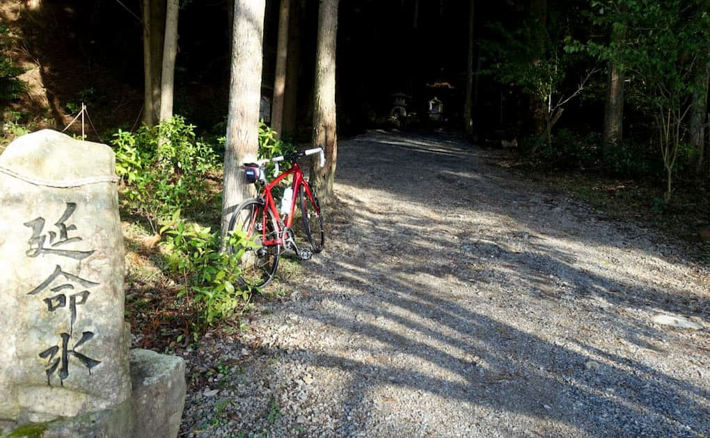

ロードに乗るのは久しぶりで、前回乗ったのを少し思い出せないほどです。
  
せっかくなので杣坂に登ってみようと久しぶりに行ってみました。運動をするのが久しぶりなので途中でバテてしまうのではと思っていたのですが、何も考えないで少しずつ登っていたら結構登れるものですね。よく運動をすると無心になると言われる方は多いですが僕は考え事をしてしまう癖があって、今日はボーッとしていたのか割と何も考えないまま峠に着いて写真を撮っていました。
  
ここで天気が怪しくなってきたので引き返せばよかったのですが、意外に疲れなかったので興味があった延命水へのルートを走ることにしました。額堂山近くを走る道ははじめて走ったので、いつになったら坂が終わるのか分からない不安と坂の向こう側はどうなっているんだろうという好奇心が入り混じりながらも登っていくと結構見晴らしが良い峠に出ました。ここが家からそんなに遠くない場所だというのが新鮮で、やっぱり自転車っておもしろいなぁと実感しました。
  
もちろん念のため少し道は事前に調べていましたが、高低差とか分かりませんし実際に走ってみないと分からないことが本当に多いです。峠を下ってすぐ延命水に着きました。この近くには湧き水が多く遠方からポリタンクを何個も持って車で来る方が多いのは知っていましたが、こんな山の上のほうにあるとは思いませんでした。
  
ここから一気に下る時に普段着じゃなくてキチンとした格好で来るべきだったと思いました。本当に冬のサイクリングは危ないです。登りは汗をかいて暑くなりますが、汗が冷やされて一気に体が冷やされます。久しぶりの運動だったので暑いまま下ることができたのは幸運でしたが次回は暖かい速乾性のインナーを着て行こうと思います。
  
水が綺麗な場所なのでホタルの里とも呼ばれている鳥川（とっかわ）へ出て再び萩のほうへ少し坂を登ってから一気に山道を下ってしばらく走ると見たことがある風景に出くわして少し安心しました。こんな小冒険みたいな感覚は久しぶりで楽しかったです。

  
&nbsp;  
