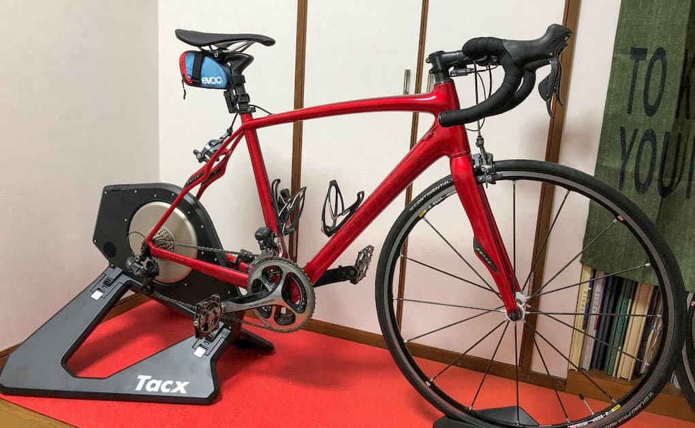
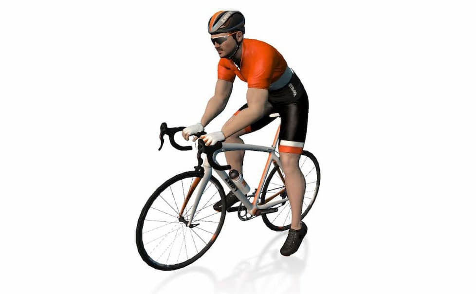

スマートトレーナーでZwiftをプレイすると負荷が自然にかかって本格的に体験できるのは知っていました。しかし今ひとつ気乗りしなかったので今まで何もしてきませんでした。ここ最近太り過ぎなのが逃げられない現実としてあったので思い切ってTacx Neo Smartを買いました。
  
iPadを画面にしようと思い専用のホルダーもついでに購入。両方で20kgを超える荷物で二階に上げるのに結構大変でした。ここでも自分の体力の低下を思い知って焦ります。

説明書は読まないことが多いのですが、今回はしっかり読まないと詰むことが多いです。
  
たとえば箱から取り出した時に台座が折りたたまれていて開こうと試みたのですがブロックされて展開できません。何かボタンでもあるだろうと探しても見つからず自分の馬鹿力で壊したら大変なので最後まで説明書を読んだら折りたたみ台座の裏側にブロックをリリースする機構がありました。取扱説明書読まなくても気づくと思うであろう簡単な操作も先入観があると気づかないものですね・・・。

スプロケットはシマノとカンパ共通になっているせいなのか勘で入れようとしたら時間がメチャクチャかかりました。グリスを忘れずに塗っておいた方がいいです。
  
ということで設置完了。この日は力尽きて寝ました。良い運動になったかな・・・。

  
&nbsp;    

スプロケは交換するのが面倒なので12-25を昔購入しておいたのを利用しました。久しぶりにペダルをこの後SPD SLに換えましたよ。マットがEliteなのは、10年くらい昔Eliteの三本ローラーを買ったときに付属していたものです。三本ローラーは飽きてしまい後輩へ譲り、マットは残していました。ここで再び陽の目を見るとは。

  
&nbsp;   

設置して次はBluetooth接続をしてペアリングをしなくてはいけません。Tacxのアプリではすんなりと認識してくれたので大丈夫だと思っていたのですがZwiftでは「検索中・・・・・」と表示されてしまいます。上の画像のように二択になっている場合は間違いなく認識していません。Bluetoothをオフにして再びオンにするか、iPadを再起動したらすんなりと認識しましたが、そんなことは知らないので正直に「検索中・・・」と出ている画面を見ながらペダルを手で回して認識してくれるのを待っている間ですでに汗だくとなりました。

  
&nbsp;   

スマートトレーナーの自動負荷は想像以上に自然で、Zwiftのコースの勾配にしたがって足が重くなっていきます。坂道のいや〜な感じが再現されて息も絶え絶えになります。ローラー台なのになぜか頑張ってしまい早々に体力を消耗してしまいます。今日は調整のために少し走っただけなのに久しぶりに激しい運動をしたような吐き気や息をすると肺からヒューヒューと音がでるような疲労具合でした。
  
僕は昔からゲームが好きで、とくにゲーセンに昔あった大型筐体のゲームが好きでした。自転車を漕ぎながらバーチャルな世界を飛ぶ「プロップサイクル」には激しくハマりしました。高校生の体力がある時ですら何回か遊んだ後は汗だくになっていたと思います。Zwiftには同じ匂いがする・・・。

  
&nbsp;   

これ、体重とか年齢を入力するんですが肥満の中年っぽさがたまらなく忠実に再現してますね。ヒゲはなんとなくつけてみましたが、本人に結構似ているので危機感を感じます。運動を続けて健康体になりたいです。頑張りすぎない程度に楽しもうと思います。