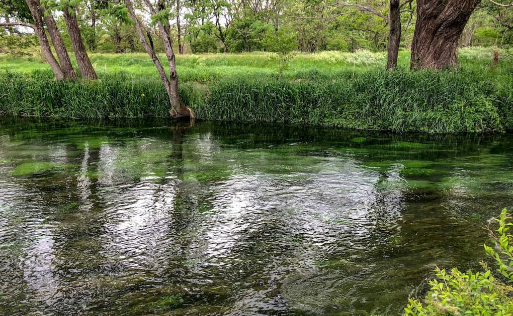

連休を使って長野県の安曇野市へ遊びに行ってきました。天気予報では午後から雨となっていたのですが到着したら天気がなんとか持ちそうだったので軽く走ることに。<!--more-->

安曇野は割と平坦で走りやすく、何と言っても北アルプスが目の前にあって景色が最高です。（晴れれば）  
信号も少なくて
大王わさび園へとゆるゆる走って怖いくらい透明な小川を眺めたりして再び安曇野の細い道を走っているうちに雨が降ってきてしまいました。  
仕方がないので自転車を車に積んで長野県に来たら立ち寄りたいスーパー「ツルヤ」に行き、オリジナルドレッシングなど買い物を楽しみました。ここのオリジナル商品は他にはないようなものが売られているのでおもしろいです。ラインナップは軽井沢店よりは少し庶民的だった・・・ような気がします。  
現地で一泊して翌日の天気もイマイチだったので自転車には乗らずにフラフラと適当に帰って来ました。  
 
旅行に行く前はある程度現地の情報を調べることにしていますが、今回は現地で発見したことが多くて楽しい旅行となりました。翌朝は雨上がりの穂高神社へお参りに行き、神社の由来を知って知的好奇心がかなり刺激されました。予定には考えていなかった松本市の開智学校の資料はとても興味深く、帰り道に偶然立ち寄ったお蕎麦屋さんでは山菜の天ぷらやざるそばを大変美味しく頂くことができて驚きと発見の連続でした。  
 
こういった無計画な旅を楽しめるようになったのも位置情報から周辺の欲しい情報だけ検索できるようになったのが大きいと思います。Googleの情報を鵜呑みにはしないけれど、ある程度参考にできるよう精度もあがってきたのではないかと思っています。もっとも「蕎麦」で近辺を検索して評価が高いお店に行ったら中華そばのお店だったというオチもあるので参考程度でいいと思います。
&nbsp;  

  
&nbsp;  

  

少ししか安曇野を走れなかったので、再度来訪して好きなだけ走ってみたいと思います。