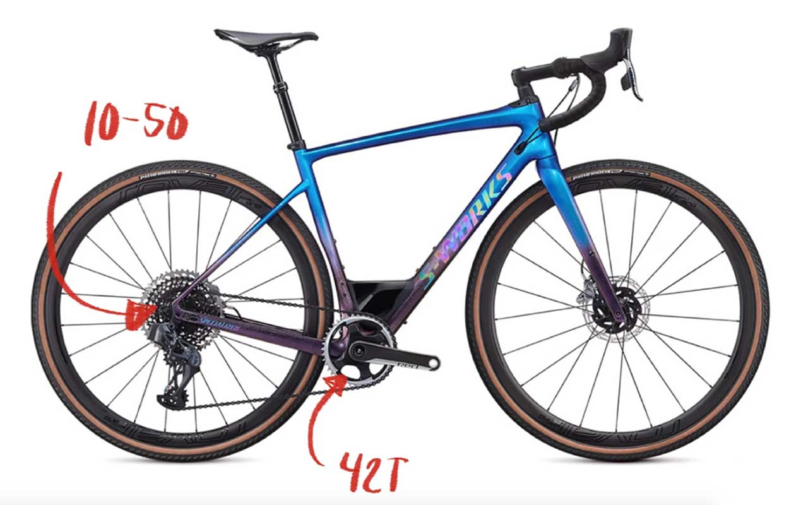

昨年発表されたSram AXS Forceに興味がでてきたので色々と妄想してみました。
<!--more-->
 

### そもそもAXSはどんなシステムなのか

[シクロワイアードの特集記事](https://www.cyclowired.jp/microsite/node/287363)をよく読むと書かれているのですが、Bluetooth接続によってブラケットのシフターとフロントディレイラーやリアディレイラーにアクセスできるだけでなく、MTBコンポーネントのEagleにも互換性があることからグラベルバイクで必要とされるかもしれないギア構成も可能なのは大きなポイントなのではないかと思っています。  
　  

　　  

ギア構成と配線に縛られない自由な選択肢は自分好みにバイクを作りたい人には魅力的なはず。日本ではSramのロードコンポーネントとMTBコンポーネントの取扱代理店が異なるので別々に買う必要があります。価格もお値打ちとは言えないません。  
　  


<table style="font-size:17px;"><caption >
Sram Etap AXS Force  油圧ディスクブレーキ <a href="http://www.intermax.co.jp/products/sram/etap_axs.html" target="blank" >(Intermaxサイトより)</a>
</caption>
  <tr><td>2x12</td><td>HRDシフトブレーキコントロール&キャリパー、フロントディレイラー、 リアディレイラー、バッテリー×2、バッテリーチャージャー、ローター(6ボルト)×2</td><td style="text-align:right">266,800円(税別)</td></tr>
  <tr><td>1x12</td><td>HRDシフトブレーキコントロール&キャリパー、リアディレイラー、 バッテリー×1、バッテリーチャージャー、ローター(6ボルト)×2</td><td style="text-align:right">220,200円(税別)</td></tr>
</table>
 
　  
　  
1x12の油圧モデルにクランク・カセット・BB・チェーンを追加して税別で30万円くらい。比較にはなりませんが、同じような構成でアメリカのSramでの正規価格だと26万円くらいになります。  
電動変速の魅力は僕自身がいまアルテグラDi2を利用して身を持って体感しているので是非導入したいところです。  
　  


　　  
　  

[SRAM ｜ Intermax](http://www.intermax.co.jp/products/sram/index.html)
もうちょっとサイトつくりに力を入れてほしい・・・。