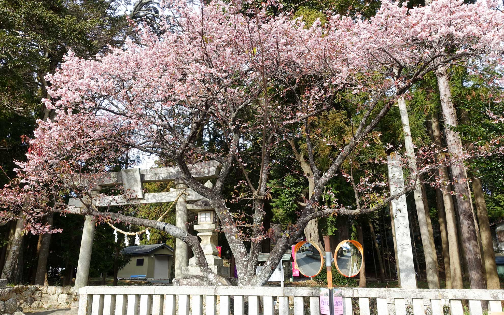
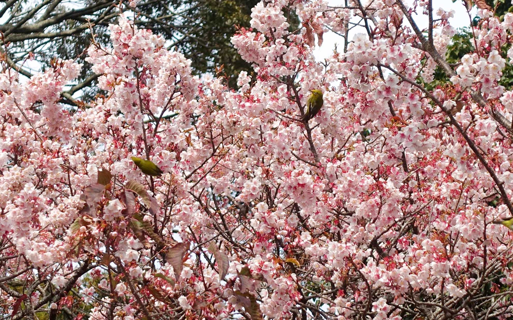
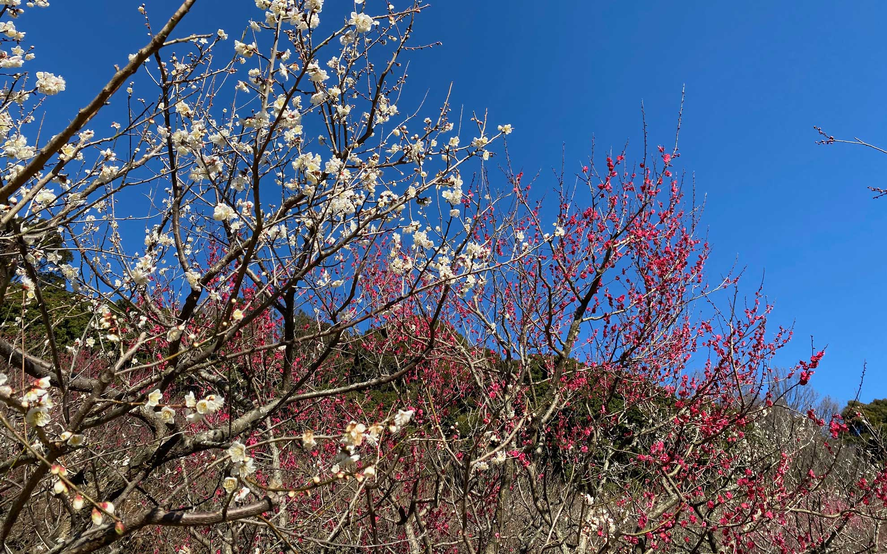
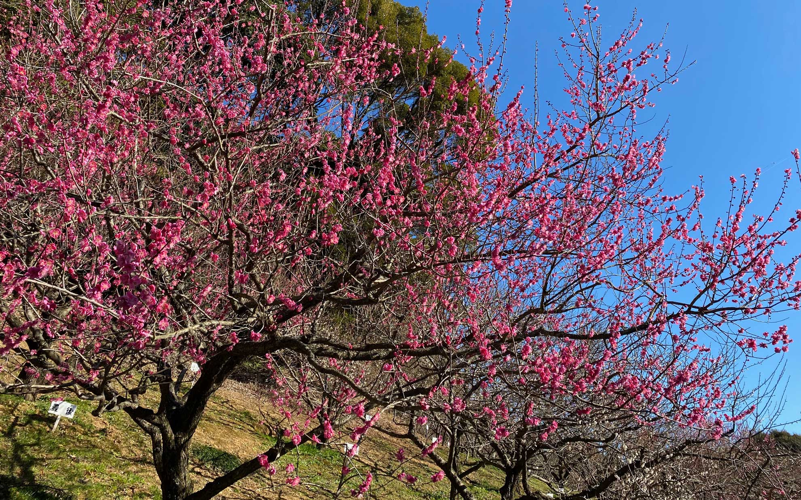

大知波の大神山八幡宮にある大知波桜を見に行ってきました。
<!--more-->
 

### 河津桜とは色が違う。

帰宅してから調べたのですが大知波桜は寒緋桜と山桜の交配種らしく、早咲きの桜で薄淡い色のもいいですね。  
かなり多くのメジロが蜜を吸うのに忙しそうに枝から枝へと飛んでいました。ズームレンズがほしい・・・。  
　　  
　  

　　  

　   
　  
ハマイチで走っていると「知波田（ちばた）」の駅ちかくを走ると思います。そこから多米峠へ向かう途中を入った場所にお宮があります。例年は1月中旬から咲き始めるそうで、近くの今川にも植樹する活動を地元の方がされているそうです。近くに看板が立っているので分かりやすいですが自動車で行く予定の方は生活道路なのでゆっくり気をつけて。駐車場もあります。来年も見にいこう。  
　　    
[「大知波桜の紹介」 - アクティブ湖西](https://www.kosai.org/joknqjg8y-2042/)
　  
　  


　　  
　　    
### 赤塚山公園の梅も見頃です。  
地元豊川の赤塚山公園の梅園も行ってきました。やっぱり今年は暖冬気味なようで、梅も早く咲き始めています。植樹されてから段々と梅の木も大きく成長してきて、梅の花の良い香りが春風に乗ってやってくるようです。ポエムか。  
今日は今年一番寒いかもしれませんが、確実に春がやってきているみたいですね。
　  

　　  

　  

