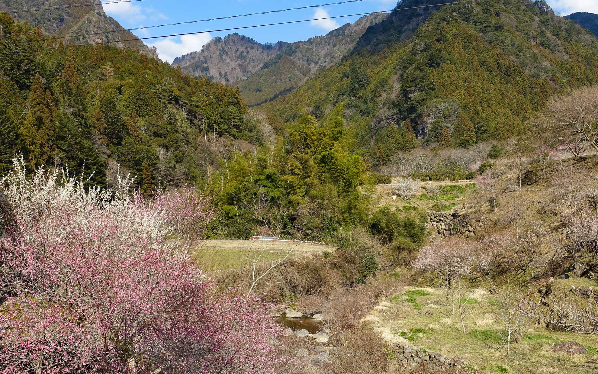
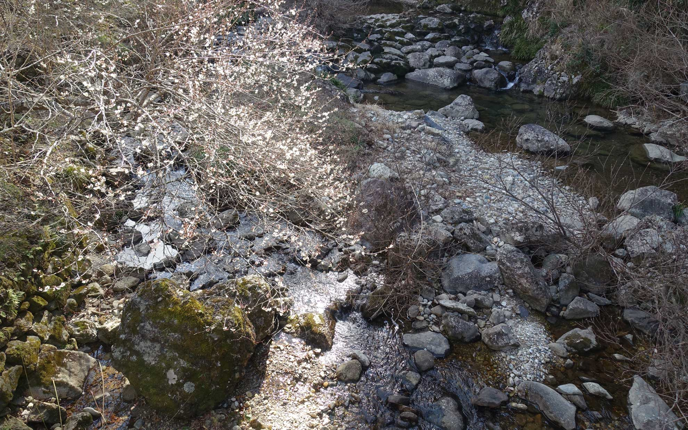
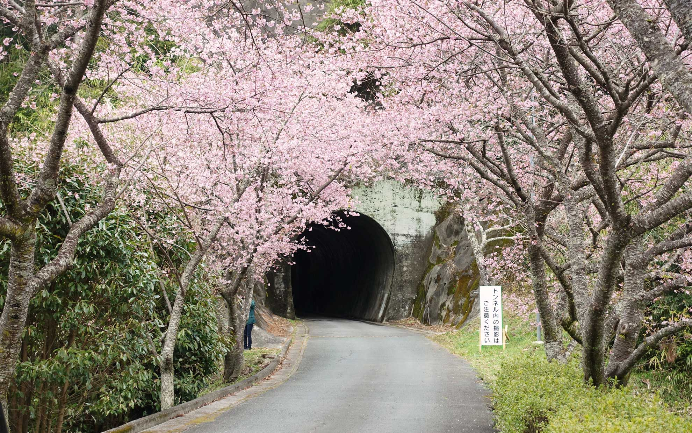
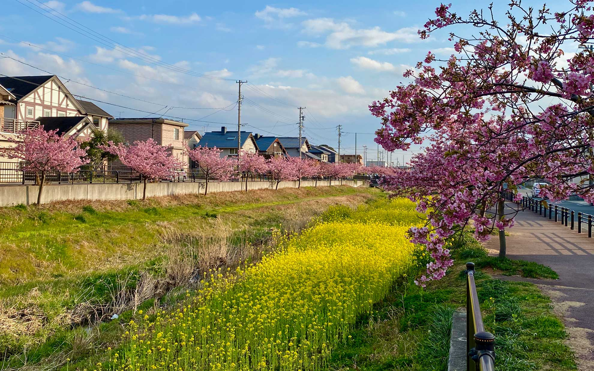

外は花粉が凄いので外出が億劫になりがちでしたが、花を見に少しお出かけしてました。
<!--more-->
 

### 川売（かおれ）の梅

少し前ですが、咲き始めの川売へ梅の花を見に行ってきました。  
海老の街を抜ける旧道から行くのが当たり前になっていましたが、今は旧道の入り口を見落としてしまうくらい新しい道が快適になって海老を通過してしまいそうになります。海老から川売までは細い道ですので行くときは注意したほうが良さそうです。  
　  
川売の梅は棚田に植えた梅や民家の庭にある梅が美しく咲いていて、里を流れる小川の流れも美しく、地元の方が普段から丁寧に手入れをされているのが伝わります。  
　　  
　  

　　  

　   
　    


　  
### 春はそこかしこに
　　  
今年も長篠の河津桜を見に行ってきました。こちらも年を経つごとに有名となって県外からの観光客の方もいらっしゃるようで、平日に行ったのですが結構多くの方がいらっしゃいました。こちらの桜は生活道路にあることからマナーを守っていつまでも見られる様にしたいところです。  
詳しくは新城市観光協会のサイトを参考にしてください。  
　   

[「長篠河津桜並木へお越しの皆さまへ」 - 新城市観光協会](https://shinshirokankou.com/event/nagashinokawazu.html)
　　   
　　  

　
　  
　　  
そうそう、豊川の河津桜も満開で、毎年木々が少しずつ大きくなるのを楽しみにしています。佐奈川だけでなく豊川のいろいろな花の名所が増えるといいですね。  
　　    
