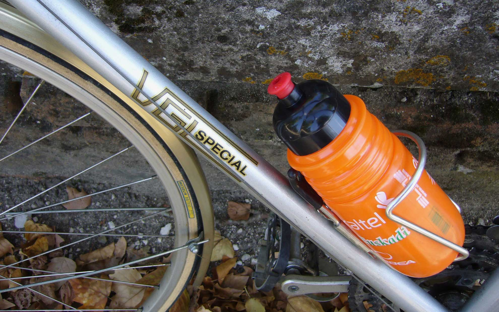
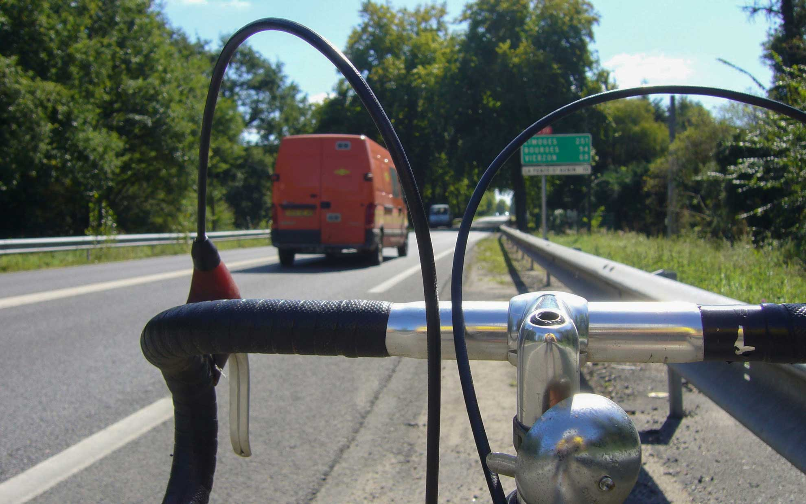

冬から春にかけてヨーロッパ行きの航空券はいつも安いのですが、今年は無理そう・・・。
<!--more-->
 

### ソローニュの森を走る

コロナで海外に行けないのは悔しいので過去の思い出を引っ張り出してみました。  
　  
ずいぶん前ですが、フランスのパリから南に電車で1時間の街に留学をしていて、そこでお世話になったステイ先のマダムの家にあった自転車を借りて近くの村まで遊びに行きました。留学中は自転車にあまり興味がなくツールやサイクリングにも無関心で、今思えば勿体なかったなぁ・・・。それでも森を抜けて真っ平らな道を走るのは気持ちがよかったです。今でも良い思い出になっています。  
　  
オルレアンの南に広がるソローニュの森には小さな村がいっぱいあって、なかには古城がある村もあります。ラ・フェルテ・サントーバンはオルレアンから20kmほどにある村で、美しいお城があります。そう遠くない距離なのでレンタサイクルでも行けそうな気がします。  
　  
お城はリノベーションされて宿泊や結婚パーティーもできるようになっているみたいです。  
　　  
ウイルスの感染がおさまって、また自由に出かけられるといいですね。　　  
　  

　　  

　   

　　  

　　  

　　  

　    



　  



