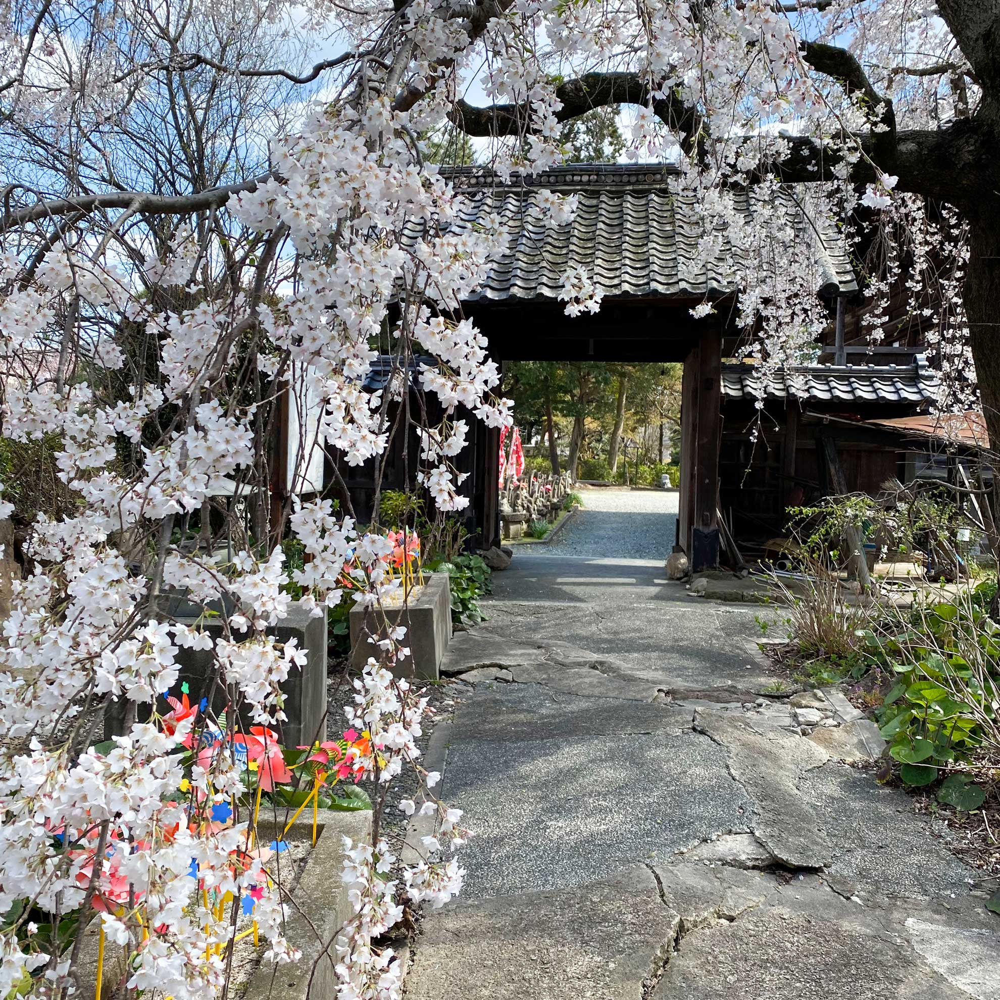
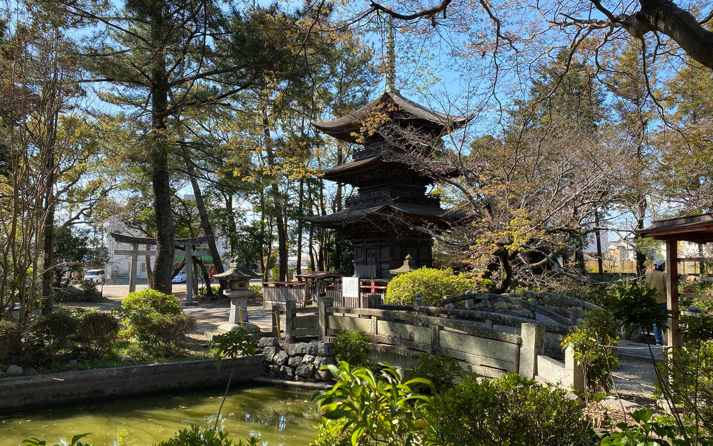
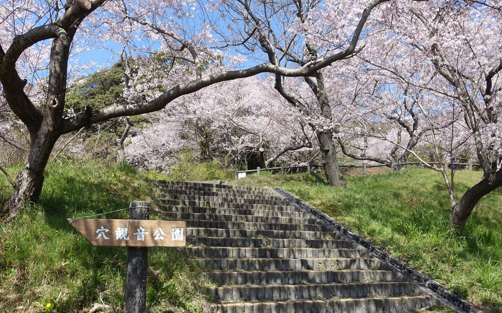
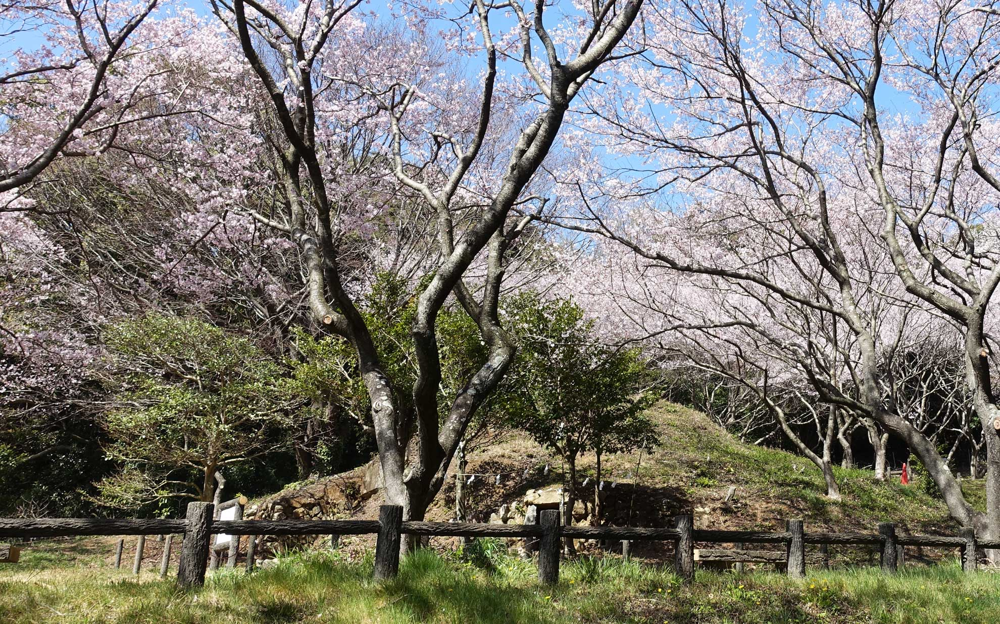
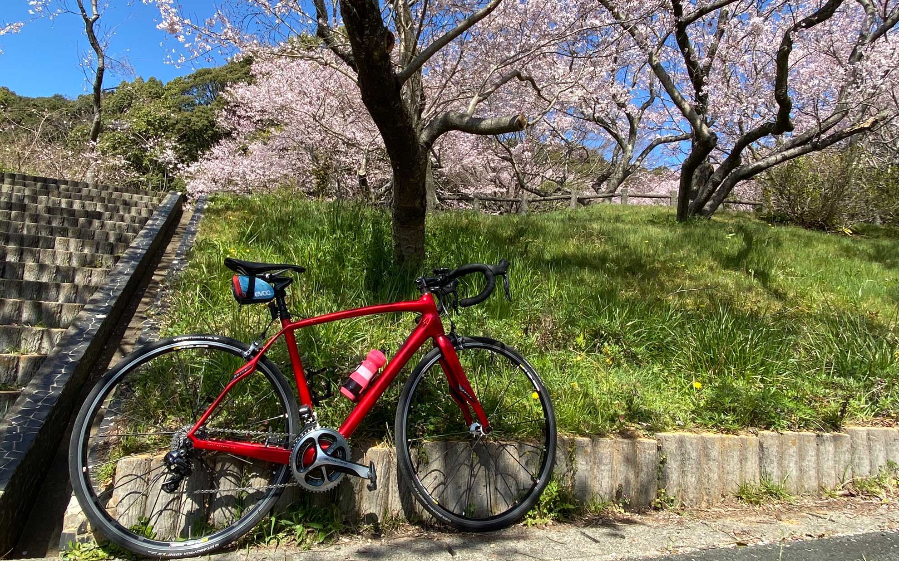
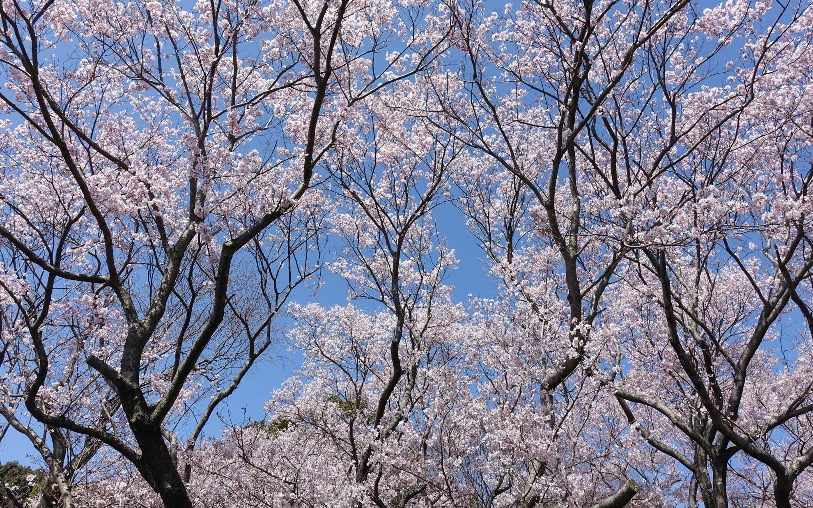

いよいよ市内の桜が本格的に咲き始めたので自転車で見に行ってきました。
<!--more-->
 

### 三明寺の枝垂れ桜
三明寺は豊川駅から徒歩15分ほどの場所にあるお寺で、国の重要文化財である三重塔が有名です。  
枝垂れ桜が綺麗なので毎年桜の季節になるとロードバイクで見に行くようになりました。昔は裏の公園は森のようになっていて、よく遊んだものです。駅周辺の再開発で道路がすっかり変わってしまいプラモデル屋さんとかなくなってしまいましたが、三明寺は昔のままで何だか安心します。  
  
　  
  
　  
  
　  
三明寺から牛久保、小坂井を抜けて御津高校まで一気に豊川市を横断してきました。お目当ては御津高校の裏山にある穴観音公園の桜です。  
以前から行きたいと思ってはいたのですが、23号線バイパスの工事で従来のルートでは行けなくなったらしく今回自転車で高校の南側から行けることを知って満開のタイミングで訪れることができました。  
　  
### 穴観音公園
穴観音公園はもともと古墳で円墳の石室に観音様が祀られていたことから名前の由来となったようです。本当に御津高校の真裏にあるので御津高生は春になるとこんな綺麗な桜を見ることができるんですね、いいなー。駐車場はないので自転車で訪れたい場所です。ちなみに現在は通学路としては禁止されているようですが、国府から御津に抜ける山道は地元の人の抜け道となっていて結構キツイ勾配で息が上がりました。  
　  
植えられているのはコヒガンザクラらしく、豊川市のソメイヨシノよりかなり早い満開を迎えていました。今日は天気が良く、体調もまずまず良かったのでロードバイクでプラプラと走りながら春を感じることができて本当によかったです。コロナウイルス感染の広がりは私達の日常生活に大きな影響を与え始めていて、とりわけ旅行などの移動や人が密集する場所へ行かないように求められる事態が続いています。すごくストレスに感じることもありますが、自転車に乗って人が少ない屋外の公園へ出かけることができて少し心が和らいだような気がします。帰宅したら手洗い・うがいは必ずする習慣も身についたし、正しい情報で恐るべきはキチンと恐れて、可能な場面では楽しめるようにしたいと思います。  
　　  
　　
　　  

　　  

　　  

　  
Google Mapには道が反映されていませんのでご注意願います。  
　  

